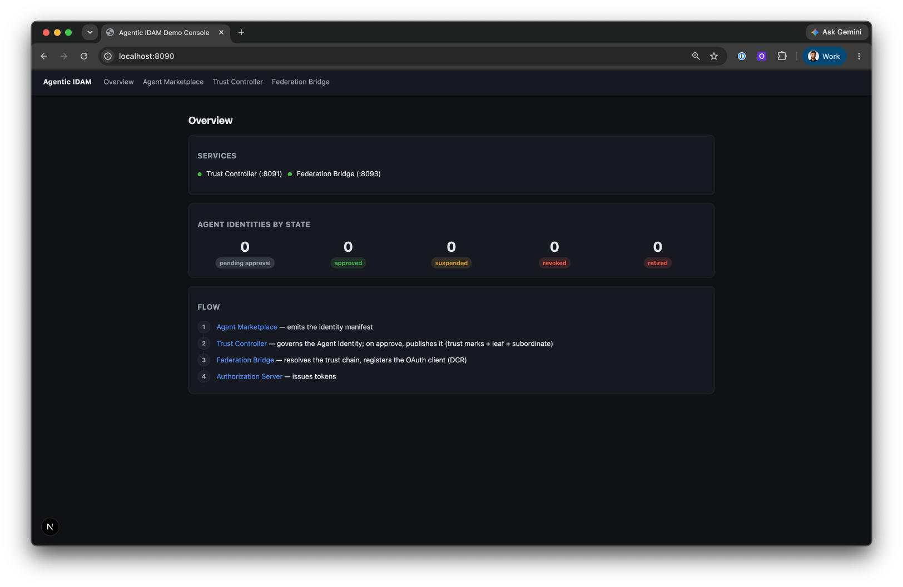
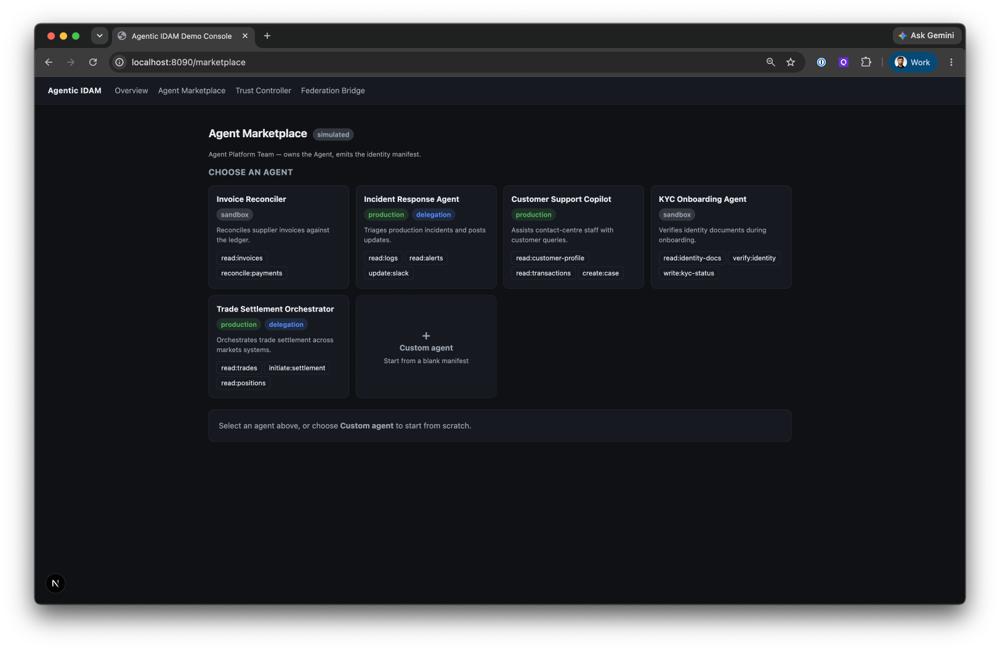
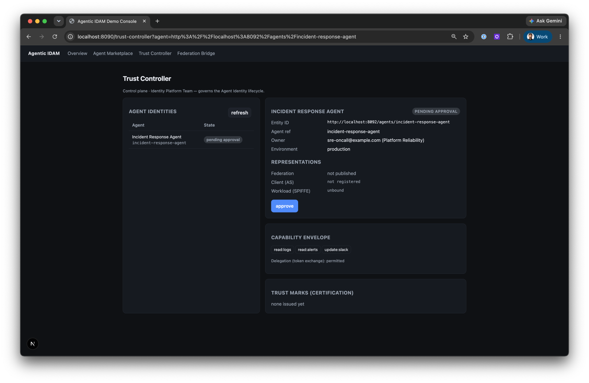
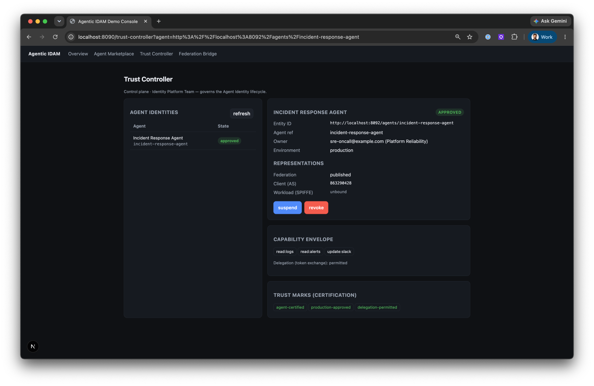
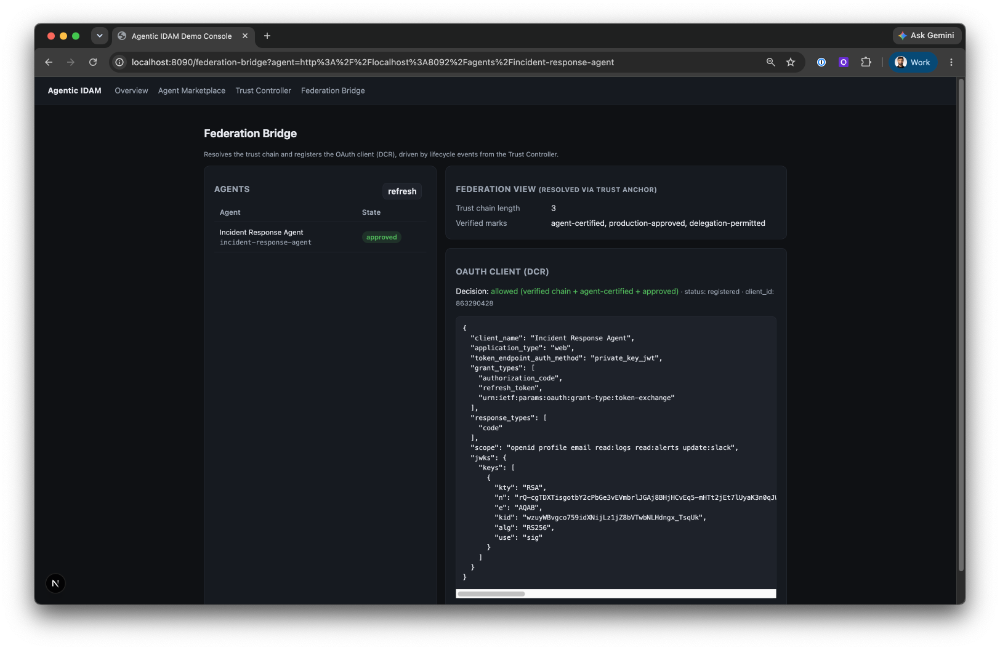

# Agentic IDAM — Trust Controller Demo

Govern an agent's identity once, then fan it out to the systems that need it — starting with an
OAuth client, cryptographically verified via the OpenID Federation trust chain.



```
Agent Marketplace  →  Trust Controller  →  Federation Bridge  →  Authorization Server
    (onboard)           (govern + publish)    (verify + register)    (Ping / Authlete)
```

The Trust Controller is powered by an OpenID Federation engine — Inmor in this demo, to be
replaced by Authlete.

## Design

- **Control plane, not token path.** The Trust Controller governs the Agent Identity; it never issues or sees tokens.
- **Zero trust.** The event carries only the `entity_id`. The bridge independently verifies the trust chain against the trust anchor *before* it provisions anything.
- **OpenID Federation automatic registration.** An OpenID Provider powered by Authlete natively supports trust-chain resolution and automatic registration — no Federation Bridge needed. For an AS that doesn't support native OpenID Federation, the bridge resolves and validates the trust chain, then uses DCR to create the OAuth client.
- **Standard DCR.** It registers a plain OAuth client (RFC 7591/7592) — point it at any DCR‑capable AS by changing one URL.
- **Reconciled to one identity.** Each bridge writes its result (e.g. `client_id`) back onto the Agent Identity, the single source of truth. Same pattern extends to workload/SPIFFE, PDP, cloud IAM.

## Services / ports

| Service | Port | Role |
|---|---|---|
| `console` (Next.js) | 8090 | Overview + Marketplace + Trust Controller + Federation Bridge |
| `trust-controller` | 8091 | control plane; governance, lifecycle, sole caller of Inmor |
| `entity-publisher` | 8092 | serves the agents' leaf entity configs (`/.well-known`) |
| `fed-bridge` | 8093 | verifies the trust chain, then registers the OAuth client (DCR) |
| Redis (ours) | 6380 | TC store (db 2) · event streams (db 1) · bridge records (db 4) |
| Inmor Admin / TA | 8000 / 8080 | federation engine — hidden behind the TC |

## Run

```bash
docker compose up -d   # our Redis on :6380
# Inmor runs separately — admin :8000, TA https :8080

# each service: cp .env.example .env, then fill the required values:
#   trust-controller/.env : INMOR_API_KEY
#   fed-bridge/.env       : TRUST_ANCHOR_JWKS  (the TA's full published JWKS)
(cd trust-controller && npm i && npm run start) &
(cd entity-publisher && npm i && npm run start) &
(cd fed-bridge       && npm i && npm run start) &
(cd console          && npm i && npm run dev)   &   # http://localhost:8090

curl -XPOST localhost:8091/setup/bootstrap        # one-time (types before TA config)
```

## Demo flow

1. **Marketplace** — pick an agent (or paste an A2A card), set the owner → *Emit Manifest*.
2. **Trust Controller** — **approve**: issues trust marks, publishes the leaf, creates the subordinate.
3. **Federation Bridge** — verifies the chain, registers the OAuth client; `client_id` appears under **Representations**.
4. **suspend / revoke** — marks revoked, leaf 404s, client deleted.

## Configuration

- `TRUST_ANCHOR_JWKS` (fed-bridge, **required**) — the TA's full JWKS; the bridge fails closed without it.
- `DCR_REGISTRATION_ENDPOINT` (fed-bridge) — the AS's registration URL (default: local `:3000`).
- `./cleanup.sh` — reset to a clean slate; keeps the trust-mark-type catalog (see the script header).

## Walkthrough

**Agent Marketplace** — pick a catalogued agent (or build a custom one) and emit the manifest.


**Trust Controller — pending** — a newly onboarded Agent Identity, before approval.


**Trust Controller — approved** — trust marks issued, leaf published, and the `client_id` reconciled back under Representations.


**Federation Bridge** — the verified trust chain, and the OAuth client registered via DCR.

